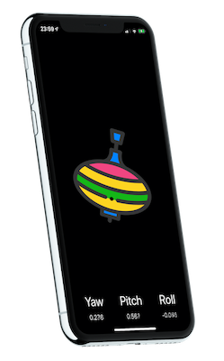

# Whirligig

> Please write an app which uses RxSwift, aggregates data from sensors (like gyroscope), gets system info and displays it. No fancy UI is expected, but having good UX would be nice.

  

## Running the app

Open `Whirligig.xcodeproj` and allow for 3rd party dependancies to download with SwiftPM.

There are two schemes:
* `Whirligig` - run this on physical device
* `Whirligig-mock` - you can run this on Simulator, to mock the Gyroscope changes

## Tests

Scheme `Whirligig` has some tests to test ViewModel behaviour.

## Challanges

Biggest challange was to get `CoreMotion` working with RxSwift because there can be only one instance per app. I found out solution from [Github](https://github.com/e-sites/RxSwiftly/blob/master/Source/CoreMotion/CMMotionManager/CMMotionManager%2Brx.swift) and from [RxCoreMotion](https://github.com/RxSwiftCommunity/RxCoreMotion) library code. Idea is using memoize to persist the same instance of `CMMotionManager`.

Second challange was to use 3D effect for `UIImageView`.

### Resources

* [Core Motion docs](https://developer.apple.com/documentation/coremotion)
* [NSHipster article](https://nshipster.com/cmdevicemotion/)
* [RxSwift CoreMotion implementation](https://github.com/e-sites/RxSwiftly/blob/master/Source/CoreMotion/CMMotionManager/CMMotionManager%2Brx.swift)
* [UIImageView 3D transform](https://stackoverflow.com/questions/56753665/swift-3d-rotation-of-uiimageview-cgaffinetransform-or-catransform3d)